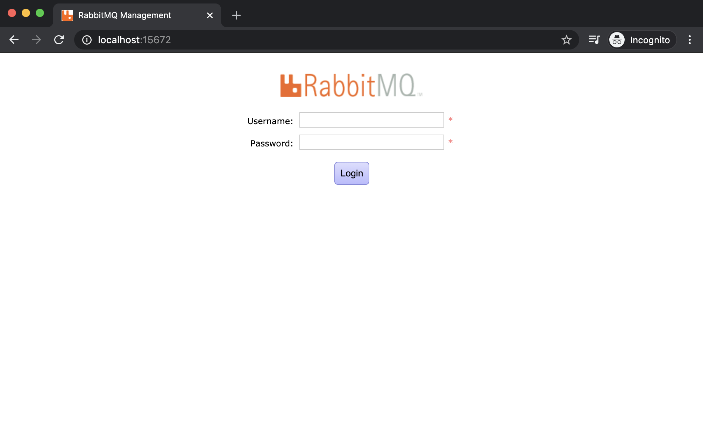
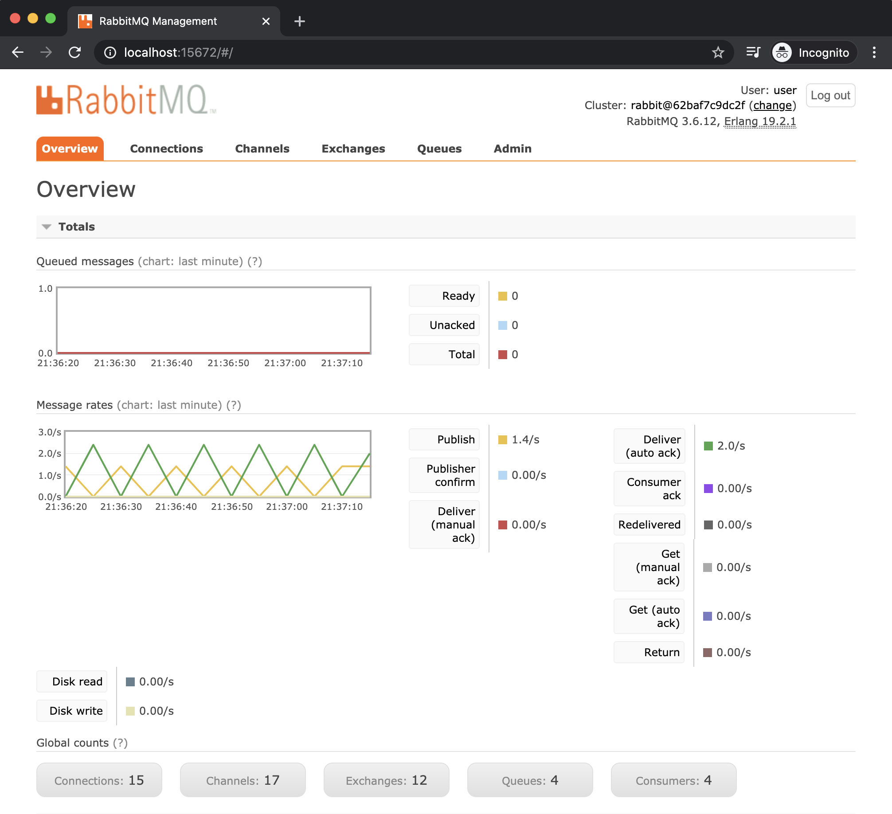
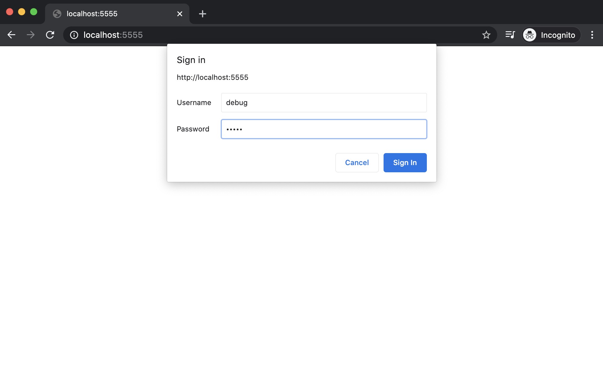
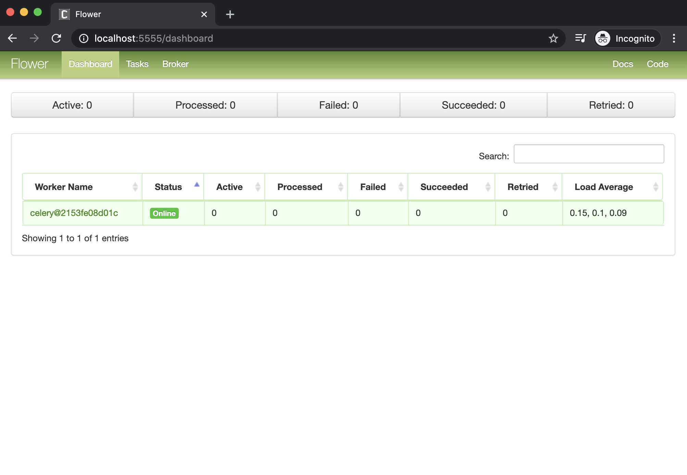
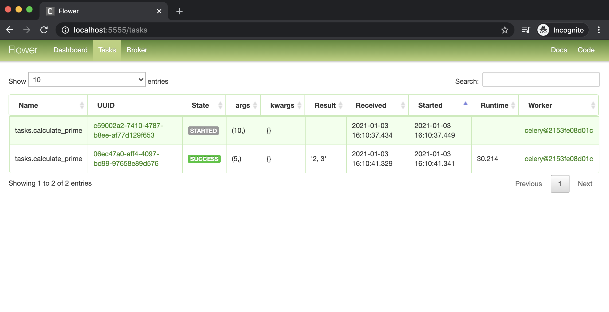
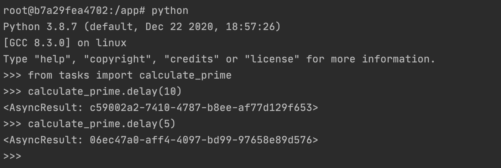
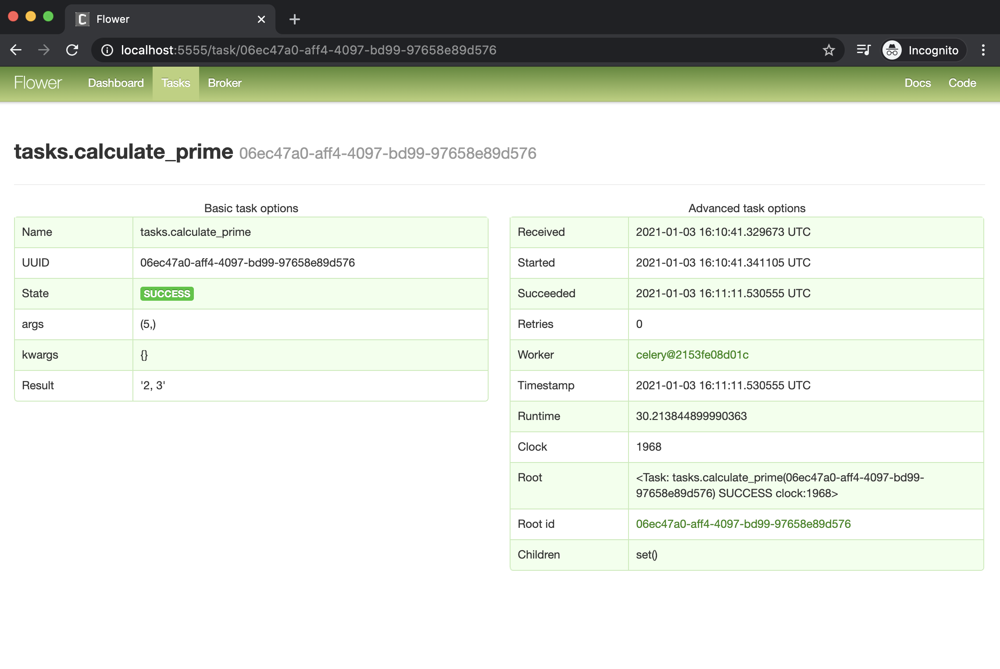

# Celery with RabbitMQ Tutorial

## Installation
```
clone the repository
```

## Building docker images
```
docker-compose -f local.yml build
```

## Running application
```
docker-compose -f local.yml up
```

## Stopping servers
```
docker-compose -f local.yml stop
```

## Destroying images
```
docker-compose -f local.yml down
```

## Disabling cache while rebuilding servers 
```
docker-compose -f local.yml build --no-cache
```

## Application URLs
- Rabbit MQ Admin: http://localhost:15672/ (user/password)
- Flower: http://localhost:5555/

## Running a test task
```
# login to server with tasks.py
docker exec -it server bash

# running task
python
from tasks import calculate_prime
calculate_prime.delay(50)

```

## Screenshots
RabbitMQ 1


RabbitMQ 2


Celery 1


Celery 2


Celery 3


Executing task


Celery 4



